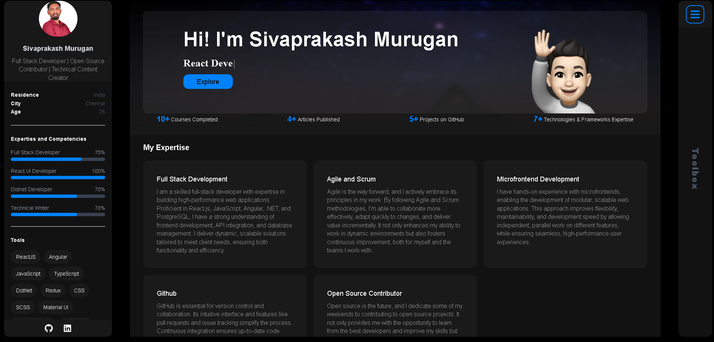

<h2 align="center">Sivaprakash Murugan - Personal portfolio</h2>
 

A personal portfolio website designed to showcase my projects, skills, and professional experience in a visually engaging and interactive way. Built using Next.js for performance and Tailwind CSS for a modern, responsive design, this portfolio highlights my expertise, technical abilities, and creative work. It serves as a central hub for potential employers, collaborators, and recruiters to explore my work, learn about my background, and easily connect with me.

<a href="https://sivaprakash-myportfolio.vercel.app"><strong>➥ Live Demo</strong></a>

 

### Demo Screeshots

### Contact

If you'd like to get in touch, feel free to connect with me on [Linkedin](https://www.linkedin.com/in/siva-prakash2507)
